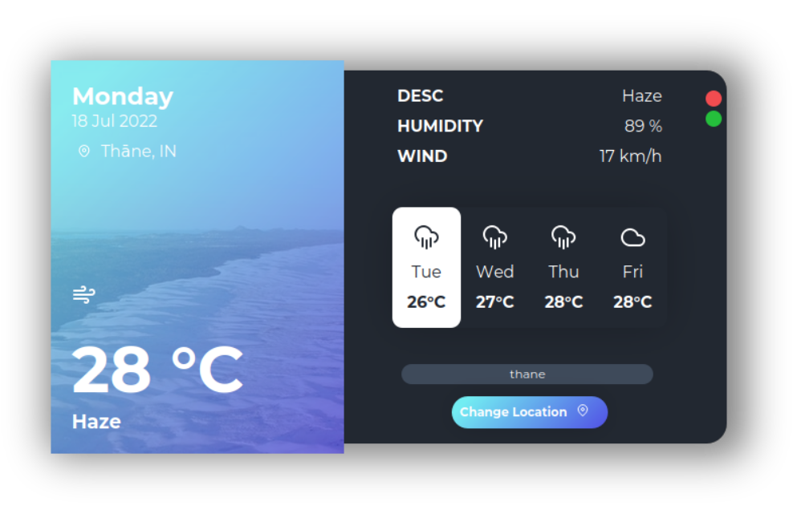

# Hi, I'm Rajyavardhan! 👋


# Weather App

Cross Plateform GUI Weather App Designed Using Python(PyQt5 and Flask).

I Fully Developed This Application in 15 Days 8 Hour


## Screenshots



## Features

- LightWeight
- Morden GUI
- Asthetic Look
- New Update Every Month

#### Linux Production/Live Release
#### Currently In Development Stage for Windows

## Installation

Install required packages for linux

[Click Here To Download](https://github.com/rajyavardhanbithale/Weather-App/releases/download/v2/rage-weather-app-linux-live.zip "Download From Here")

```bash
  sudo apt install python3-pyqt5 python3-pyqt5.qtwebengine 
  python3-pyqt5.qtwebkit python3-pyqt5.qtquick python3-pyqt5.qtwebchannel  
  python3-flask 
```
Install required packages for Windows

[Click Here To Download](https://github.com/rajyavardhanbithale/Weather-App/releases/download/v2-pre/rage-weather-app-windows.pre-alpha.zip "Download From Here")

```bash
  pip install PyQt5 flask requests PyQtWebEngine

```

# Deployment
#### Make Sure That You Connected To Internet
To deploy this project on Linux run

```bash
  python3 run.py
```

To deploy this project on Windows run

```bash
  python run.py
```

## Preview
#### On Hover


#### On Linux


#### On Windows

## Used By

This project is used by:

- Rage-Security's https://github.com/Rage-Security


## Roadmap 2022-*

- Animated Icon

- Add more Features


## Contributing

Contributions are always welcome!

See `contributing.md` for ways to get started.

Please adhere to this project's `code of conduct`.


## 🚀 About Me
I'm a full stack developer...


## 🛠 Skills
Python Frontend-Backend, HTML and CSS Frontend Only!!


## Feedback

If you have any feedback, please reach out to us at ragesec@protonmail.com
